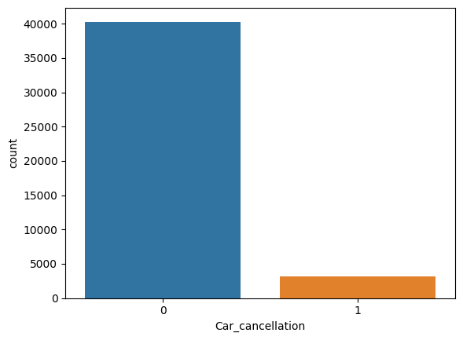
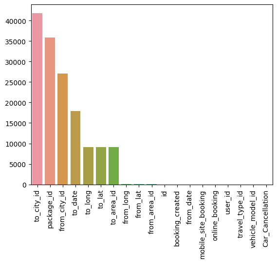
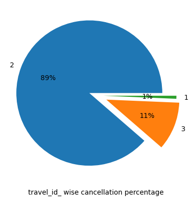
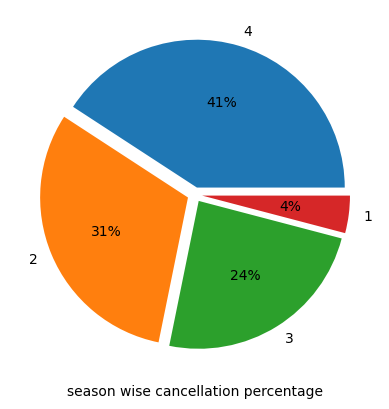
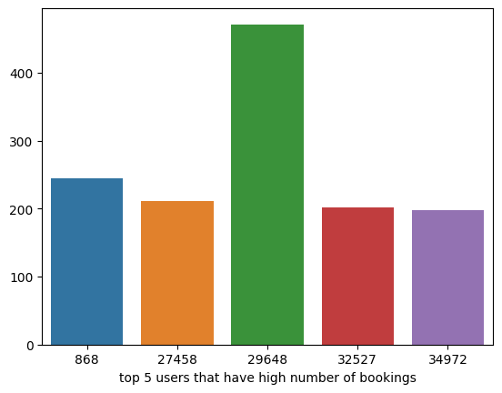

# yourcab

### Description
- ### Business problem tackled here is trying to improve customer service for YourCabs.com, a cab company in Bangalore.
- ### The problem of interest is booking cancellations by the company due to unavailability of a car. The challenge is that cancellations can occur very close to the trip start time, thereby causing passengers inconvenience.

### Goal
- ### The goal of the competition is to create a predictive model for classifying new bookings as to whether they will eventually gets cancelled due to car unavailability.

### Insights
- Imbalanced datset
    - 

- Number of unique values
    - 

- travel id wise cancellation
    - 

- Season wise cancellation

    - 
- Spring has least amount of cancellation
- Winter has highest number of cancellation

- Top 5 user with highest number of bookings

    - 